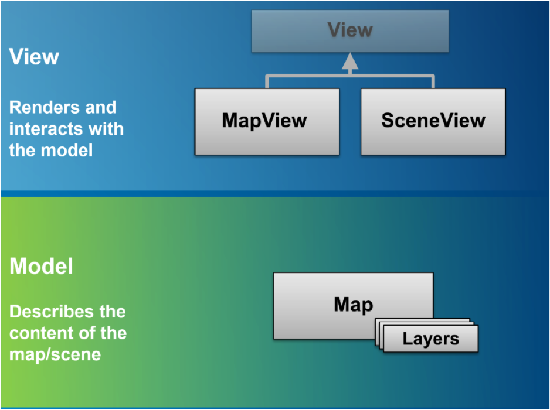
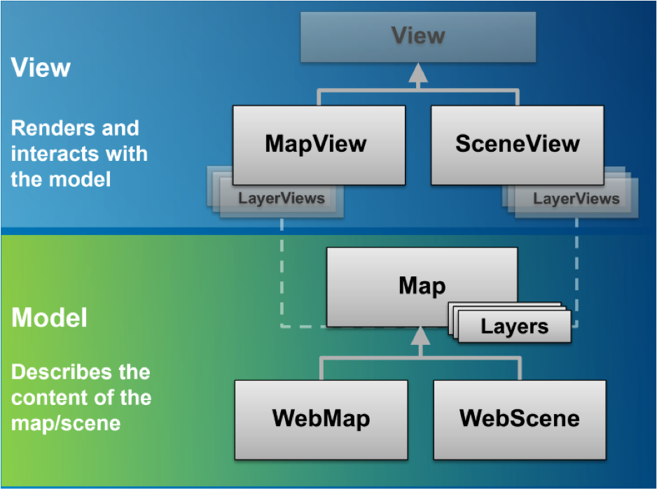

<!-- .slide: data-background="images/webinar-start.jpg" -->

---

<!-- .slide: data-background="images/webinar-title.jpg" -->


---

# Presenters

### Andy Gup – [@agup](https://twitter.com/agup)
### René Rubalcava – [@odoenet](https://twitter.com/odoenet)

---

# Agenda

- Introduction to the ArcGIS API 4 for JavaScript
- Fundamentals and Patterns
- Questions
- Visualizations (2D and 3D)
- Extensibility
- Framework Integration
- _Bonus - Custom Builds_
- Questions

---

# Introduction to the ArcGIS API 4 for JavaScript

- Simplified and consistent API <!-- .element: class="fragment" data-fragment-index="1" -->
- Write apps in ES6 or TypeScript <!-- .element: class="fragment" data-fragment-index="1" -->
- Modern browser support (IE11+) <!-- .element: class="fragment" data-fragment-index="1" -->
- 3D support (No plugin required!) <!-- .element: class="fragment" data-fragment-index="1" -->
- And many more! <!-- .element: class="fragment" data-fragment-index="1" -->

---

# Where to begin?

<br>

- https://developers.arcgis.com/javascript

<br>

```
<link rel="stylesheet" href="https://js.arcgis.com/4.4/esri/css/main.css">
<script src="https://js.arcgis.com/4.4/"></script>
```

---

## Hello World Map

<br>

```js
  var map = new Map({
    basemap: "streets"
  });

  var view = new MapView({
    container: "viewDiv",  
    map: map               
  });

```

---

## Fundamentals and Patterns

- Map and View

- Map
  - Contains Layers, data model for the world
- MapView and SceneView
  - Responsible for rendering the Map

---

### Map and View Relationship



---

### Map and View Relationship



---

## Basemap, Ground and Operational Layers

Layers are separated into 3 main groups.
 - `basemap`
 - `ground`
 - operational `layers`

`basemap` and `ground` gives context to the operational `layers`.

---

## Basemap, Ground and Operational Layers

- `basemap` and `ground` can be set by well-know ids:

```js
const map = new Map({

  /*
   streets, satellite, hybrid, terrain, topo, gray,
   dark-gray, oceans, national-geographic, osm,
   dark-gray-vector, gray-vector, streets-vector, topo-vector,
   streets-night-vector, streets-relief-vector, streets-navigation-vector
   */
  basemap: "streets"

  /*
   world-elevation 
   */
  ground: "world-elevation" 

});
```

---

## Basemap, Ground and Operational Layers

- or by specifying them

<iframe height='600' scrolling='no' title='Basemaps' src='//codepen.io/odoe/embed/WEPydQ/?height=265&theme-id=0&default-tab=js,result&embed-version=2' frameborder='no' allowtransparency='true' allowfullscreen='true' style='width: 100%;'>See the Pen <a href='https://codepen.io/odoe/pen/WEPydQ/'>Basemaps</a> by Rene Rubalcava (<a href='https://codepen.io/odoe'>@odoe</a>) on <a href='https://codepen.io'>CodePen</a>.
</iframe>

---

## Basemap, Ground and Operational Layers

- `basemap` can also be set by item id.

```js
const map = new Map({

  basemap: {
    portalItem: {
      id: "8b3d38c0819547faa83f7b7aca80bd76"
    }
  }

});
```

---

## Basemap, Ground and Operational Layers

- `Map.layers` contains `Layer` objects with the operational data the user interacts with.

<iframe height='600' scrolling='no' title='Webinar - Add a FeatureLayer' src='//codepen.io/odoe/embed/YxJEba/?height=265&theme-id=0&default-tab=js,result&embed-version=2' frameborder='no' allowtransparency='true' allowfullscreen='true' style='width: 100%;'>See the Pen <a href='https://codepen.io/odoe/pen/YxJEba/'>Webinar - Add a FeatureLayer</a> by Rene Rubalcava (<a href='https://codepen.io/odoe'>@odoe</a>) on <a href='https://codepen.io'>CodePen</a>.
</iframe>

---

## Basemap, Ground and Operational Layers

- At any point you can modify any on those groups of layers using the `Collection` API.

```js
// basemap
map.basemap.baseLayers.add(layer);
map.basemap.baseLayers.addMany([layer]);
map.basemap.baseLayers.remove(layer);
map.basemap.baseLayers.removeMany([layer]);
map.basemap.baseLayers.removeAll();

map.basemap.referenceLayers.add(layer);

map.ground.add(layer);

map.layers.add(layer);

// short hand
map.add(layer);
```

---

## Basemap, Ground and Operational Layers

- `GroupLayer`

<iframe height='600' scrolling='no' title='Webinar - Grouplayer' src='//codepen.io/odoe/embed/RZOjrv/?height=265&theme-id=0&default-tab=js,result&embed-version=2' frameborder='no' allowtransparency='true' allowfullscreen='true' style='width: 100%;'>See the Pen <a href='https://codepen.io/odoe/pen/RZOjrv/'>Webinar - Grouplayer</a> by Rene Rubalcava (<a href='https://codepen.io/odoe'>@odoe</a>) on <a href='https://codepen.io'>CodePen</a>.
</iframe>

---

## Basemap, Ground and Operational Layers

- They can be easily searched using `Map.allLayers`
  - contains the layers from every collection

```js
const layer = map.allLayers.find((layer) => {
  return layer.title === "what I'm looking for";
});
```

---

## Layers and LayerViews

|            |          |
| ------------- | -------------:|
| FeatureLayer | TileLayer |
| GraphicsLayer | Grouplayer |
| MapImageLayer | VectorTileLayer |
| ImageryLayer | CSVLayer |
| GeoRSSLayer | KMLLayer |
| ElevationLayer | OpenStreetMapLayer |
| SceneLayer (3D) | PointCloudsLayer (3D) |
| IntegratedMeshLayer (3D) | StreamLayer |
| WebTileLayer | WMSLayer |
| WMTSLayer |  |

---

## Layers

- `Layer.fromPortalItem(...)`

<iframe height='600' scrolling='no' title='Portal Items' src='//codepen.io/odoe/embed/OjQLmK/?height=265&theme-id=0&default-tab=js,result&embed-version=2' frameborder='no' allowtransparency='true' allowfullscreen='true' style='width: 100%;'>See the Pen <a href='https://codepen.io/odoe/pen/OjQLmK/'>Portal Items</a> by Rene Rubalcava (<a href='https://codepen.io/odoe'>@odoe</a>) on <a href='https://codepen.io'>CodePen</a>.
</iframe>

---

## Layers

- MapImageLayer

<iframe height='600' scrolling='no' title='Webinar - MapImageLayer' src='//codepen.io/odoe/embed/EvJbvE/?height=265&theme-id=0&default-tab=js,result&embed-version=2' frameborder='no' allowtransparency='true' allowfullscreen='true' style='width: 100%;'>See the Pen <a href='https://codepen.io/odoe/pen/EvJbvE/'>Webinar - MapImageLayer</a> by Rene Rubalcava (<a href='https://codepen.io/odoe'>@odoe</a>) on <a href='https://codepen.io'>CodePen</a>.
</iframe>

---

## Layers

- MapImageLayer

<iframe height='600' scrolling='no' title='Webinar - MapImageLayer - Renderer' src='//codepen.io/odoe/embed/rzbYqv/?height=265&theme-id=0&default-tab=js,result&embed-version=2' frameborder='no' allowtransparency='true' allowfullscreen='true' style='width: 100%;'>See the Pen <a href='https://codepen.io/odoe/pen/rzbYqv/'>Webinar - MapImageLayer - Renderer</a> by Rene Rubalcava (<a href='https://codepen.io/odoe'>@odoe</a>) on <a href='https://codepen.io'>CodePen</a>.
</iframe>

---

## Layers

- VectorTileLayer

<iframe height='600' scrolling='no' title='Webinar - VectorTileLayer' src='//codepen.io/odoe/embed/EvJbrd/?height=265&theme-id=0&default-tab=js,result&embed-version=2' frameborder='no' allowtransparency='true' allowfullscreen='true' style='width: 100%;'>See the Pen <a href='https://codepen.io/odoe/pen/EvJbrd/'>Webinar - VectorTileLayer</a> by Rene Rubalcava (<a href='https://codepen.io/odoe'>@odoe</a>) on <a href='https://codepen.io'>CodePen</a>.
</iframe>

---

## LayerViews


---

## LayerViews

- `LayerViews` renders the layers on the screen.
- [LayerView](https://developers.arcgis.com/javascript/latest/api-reference/esri-views-layers-LayerView.html) API.
- Give info about layer rendering
- Give access to data available to draw on the screen
 - Features
 - Elevation data

---

## LayerViews

- There is a layerview per layer in the map
  - except if the layer is not supported
    - incompatible SpatialReference
    - incompatible tile cache
    - 3D layer and a MapView
- Like `Map`, a view has multiple collection of layerviews.

---

## LayerViews

- access a layerview with [`View.whenLayerView()`](https://developers.arcgis.com/javascript/latest/api-reference/esri-views-View.html#whenLayerView) 

```js
  const map = new Map({
    basemap: 'topo'
  });
  const mapView = new MapView({
    map: map,
    container: 'mapDiv'
  });

  const layer = new FeatureLayer(...)
  map.add(layer);

  view.whenLayerView(layer)
    .then((layerView) => {
      layerView.visible = false
    });
```
- or [`View.allLayerViews`](https://developers.arcgis.com/javascript/latest/api-reference/esri-views-View.html#allLayerViews) 

---

## LayerViews

<iframe height='600' scrolling='no' title='FeatureLayer' src='//codepen.io/odoe/embed/vJdVpQ/?height=265&theme-id=0&default-tab=js,result&embed-version=2' frameborder='no' allowtransparency='true' allowfullscreen='true' style='width: 100%;'>See the Pen <a href='https://codepen.io/odoe/pen/vJdVpQ/'>FeatureLayer</a> by Rene Rubalcava (<a href='https://codepen.io/odoe'>@odoe</a>) on <a href='https://codepen.io'>CodePen</a>.
</iframe>

---

## Accessor

- Autocasting
- Property watching
- Consistent API

---

## Accessor

- Autocasting

```js
const view = new MapView({
  container: "viewDiv",
  map: map,
  extent: { // autocast to an Extent class
    xmin: -9177811,
    ymin: 4247000,
    xmax: -9176791,
    ymax: 4247784,
    spatialReference: 102100
  }
});
```

---

## Accessor

- Property watching

```js
  map.watch("basemap.title", (
    newValue, // new title
    oldValue, // old title
    propertyName // basemap.title,
    target // map
    ) => {
    console.log("watch", newValue);
  });

  watchutils.watch(map, "basemap.title", (title) => {
    console.log("watch", title);
  });
```

---

# Widgets!

- ~20 Widgets out of the box <!-- .element: class="fragment" data-fragment-index="1" -->
- Widgets help make great apps <!-- .element: class="fragment" data-fragment-index="1" -->
- Less code for you to write <!-- .element: class="fragment" data-fragment-index="1" -->
- Designed with responsive apps in mind <!-- .element: class="fragment" data-fragment-index="1" -->
- We'll look at a few key widgets <!-- .element: class="fragment" data-fragment-index="1" -->

---

# Default Widgets

- MapView & SceneView <!-- .element: class="fragment" data-fragment-index="1" -->
  - Popup
  - Attribution
  - Zoom
- SceneView <!-- .element: class="fragment" data-fragment-index="2" -->
  - NavigationToggle
  - Compass

---

# Widgets: SDK

[Widgets in SDK](https://developers.arcgis.com/javascript/latest/api-reference/esri-widgets-Attribution.html)

---

# Widgets: Popup

- Responsive Design
- Size changes depending on size of view
- Can be docked to top, bottom, center and sides
- [Popup Sample](https://developers.arcgis.com/javascript/latest/sample-code/sandbox/index.html?sample=popup-actions)

---

<iframe height='600' scrolling='no' title='Popup Docking' src='//codepen.io/odoe/embed/qXwoRy/?height=265&theme-id=0&default-tab=result&embed-version=2' frameborder='no' allowtransparency='true' allowfullscreen='true' style='width: 100%;'>See the Pen <a href='https://codepen.io/odoe/pen/qXwoRy/'>Popup Docking</a> by Rene Rubalcava (<a href='https://codepen.io/odoe'>@odoe</a>) on <a href='https://codepen.io'>CodePen</a>.
</iframe>

---

# Widgets: Expand

- Collapsable button/panel <!-- .element: class="fragment" data-fragment-index="1" -->
- Can be used with widgets, dom node, HTML <!-- .element: class="fragment" data-fragment-index="2" -->
- Designed for view component use <!-- .element: class="fragment" data-fragment-index="3" -->

---

# Widgets: Expand Sample

- [Expand Sample](https://developers.arcgis.com/javascript/latest/sample-code/sandbox/index.html?sample=widgets-expand)

```
var htmlString = "<div style='background:red'>Hello World</div>";

var node = document.createElement("div");
node.innerHTML = "Hello World 2";
node.style.backgroundColor = "blue";

var bgExpand = new Expand({
  view: view,
  //content: htmlString,
  //content: node,
  content: basemapGallery,
  expandIconClass: "esri-icon-basemap"
});
```

---

# View

Useful [view properties](https://developers.arcgis.com/javascript/latest/api-reference/esri-views-View.html#properties-summary) for building apps

- ui
- padding

---

# View UI

- View has `ui` property
- Can has `components` that can hold...
  - Widget, DOM node, text, html string
- [Default UI](https://developers.arcgis.com/javascript/latest/api-reference/esri-views-ui-DefaultUI.html)

---

# View UI: Components

- Provide easy way to add/position widgets on a view
- [SDK](https://developers.arcgis.com/javascript/latest/api-reference/esri-views-ui-DefaultUI.html#components)

---

## Components Demo

<iframe height='600' scrolling='no' title='Components' src='//codepen.io/odoe/embed/MvdOXm/?height=265&theme-id=0&default-tab=js,result&embed-version=2' frameborder='no' allowtransparency='true' allowfullscreen='true' style='width: 100%;'>See the Pen <a href='https://codepen.io/odoe/pen/MvdOXm/'>Components</a> by Rene Rubalcava (<a href='https://codepen.io/odoe'>@odoe</a>) on <a href='https://codepen.io'>CodePen</a>.
</iframe>

---

## Positions Demo

- [UI Positions Demo](https://codepen.io/odoe/pen/mMYqGZ?editors=0010)

---

# View: Padding

- View will work off a subsection of the full view
- Useful when UI covers portion of the view
- [SDK](https://developers.arcgis.com/javascript/latest/api-reference/esri-views-MapView.html#padding)

---

# Demo

- [View Padding Demo](../demos/view-padding/panel-view-padding.html)

---

# View UI: CSS

- Breakpoints also add classes on view

```css
.esri-view esri-view-height-xsmall,
.esri-view-height-less-than-small,
.esri-view-height-less-than-medium,
.esri-view-height-less-than-large,
.esri-view-height-less-than-xlarge,
.esri-view-width-xlarge,
.esri-view-width-greater-than-xsmall,
.esri-view-width-greater-than-small,
.esri-view-width-greater-than-medium,
.esri-view-width-greater-than-large,
.esri-view-orientation-landscape {}
```

---

# Demo

- [View UI Sizes](../demos/view-sizes/panel-dynamic.html)

---

# Platform Integration

<br>
## Creating Services
## Importing Web Maps and Scenes

---

# Questions

---

# Visualizations

---

# Upcoming Features

---

# 3rd Party JS Frameworks
# Module loaders
- Open-source helper libraries and wrappers
- Small internal + large external community effort
- Not officially supported by Esri Tech Support


---

# 3rd Party JS Frameworks
# Module loaders
- [esri-loader](https://github.com/Esri/esri-loader)
- [angular-esri-loader](https://github.com/tomwayson/angular-esri-loader)
- [ember-esri-loader](https://github.com/Esri/ember-esri-loader)
- [ember-cli-amd](https://github.com/Esri/ember-cli-amd)
- [esri-loader-react](https://github.com/davetimmins/esri-loader-react)

---

## Framework Integration

- React
- Angular (version of choice)
- Ember
- VueJS

---

## Framework Integration

- React
 - Vanilla React (`setState()`)
 - Redux
 - Preact

---

## Framework Integration

- React
- [react-redux-js4](https://github.com/Esri/react-redux-js4)

---

## Framework Integration

- Angular
  - _In all it's forms_
  - Changing often!
  - Try to keep up
  - [angular2-esri-playground](https://github.com/jwasilgeo/angular2-esri-playground)

---

## Framework Integration

- Ember
  - Full-blown framework
  - Started the cli craze
  - Great for teams!
  - Use the `ember-esri-loader` or `ember-cli-amd`

---

## Framework Integration

- Vue
  - Super simple to get started
  - Has a cli too!
  - [vue-jsapi4](https://github.com/odoe/vue-jsapi4)

---

## Framework Integration (BONUS!)

- Elm
  - Completely new programming language
  - Comes with a UI architecture built-in
  - [elm-jsapi4](https://github.com/odoe/elm-jsapi4)

---

# Custom Builds

---

## Custom Builds
- [Dojo](https://github.com/Esri/jsapi-resources/tree/master/4.x/bower/dojo)
- [Webpack](https://github.com/odoe/odoenet-esrijs)

---

## Dojo Builds

- Pros
  - Compact
  - Single file and layer builds (bundles)
- Cons
  - Not fast
  - Can be complicated

---

## Dojo Builds

- `build.profile.js`

```js
var profile = {
  ...
    layers: {
    "dojo/dojo": {
      boot: true,
      customBase: true,
      include: [
        "app/main",
        ...
      ]
    },
    "esri/views/2d/layers/VectorTileLayerView2D": {
      ...
    },
    "esri/core/workers/WorkerConnection": {
      ...
    },
    "esri/views/vectorTiles/WorkerTileHandler": {
      ...
  },
  ...
};
```

---

## Webpack Builds

- Pros
  - Fast
  - Lots of community support
- Cons
  - Not fully compatible with Dojo loader
  - Built apps require CDN

---

## Webpack Builds

- `webpack.config.js`
- ignore the `esri` and `dojo` modules

```js
module.exports = {
  ...
  externals: [
    function(context, request, callback) {
      if (
        /^dojo/.test(request) ||
        /^dojox/.test(request) ||
        /^dijit/.test(request) ||
        /^esri/.test(request)
      ) {
        return callback(null, "amd " + request);
      }
      callback();
    }
  ]
};
```

---

# Developer Resources
- [TypeScript definition files, Bower, JSHint](http://esriurl.com/resources)
- [github.com/esri](https://github.com/esri)
- [GeoNet Community for Web Developers](https://geonet.esri.com/community/developers/web-developers/arcgis-api-for-javascript)

---

# Blogs
- [ArcGIS Blog](https://blogs.esri.com/esri/arcgis/tag/javascript/)
- [GeoDev Blog](https://geonet.esri.com/groups/geodev)
- [odoe.net](http://odoe.net/blog/)

---

# Get The Code

## [webinar-2017-discovering-the-arcgis-javascript-4.x-api](http://odoe.github.io/webinar-2017-discovering-the-arcgis-javascript-4.x-api/slides/)

---

# Take our quick survey!
### URL goes here?  

<br>
 
# Sign up for future webinars!
### URL goes here?
 

---


# Questions


## developeroutreach@esri.com


---

<!-- .slide: data-background="images/webinar-end.jpg" -->
